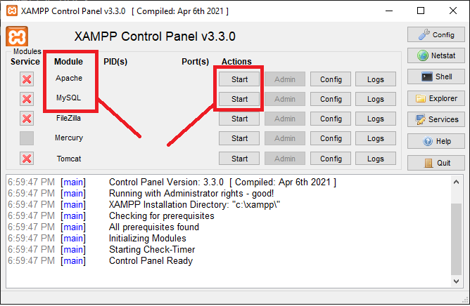
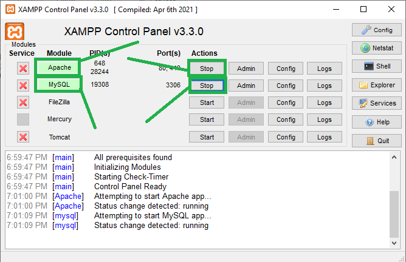

## Description
Maintle is an online movie script business where potential buyers can visit this site and purchase high quality movie scripts. It also comes packaged with an admin dashboard fully equiped to assist the Maintle team in getting the best possible results


## Tech Stack
### Frontend
- Vue.js
- HTML/CSS/JS

### Backend
- Laravel 
- Inertia.js
- Node.js

### Utilities
- Vite
- FontAwesome
- Tailwind

### Server | Database 
- AWS

## Project Structure

**NOTE**: The folders mentioned here are the core folders. You do not need to understand every folder but just what will ensure the web application can start up and you can make the needed changes.You might modify other folders if you're told or aware of what you are doing. But it's Recommended to stick within the overall structure.

### Frontend 
```cmd
├───resources
│   ├───css
│   ├───js
│   │   ├───Components
│   │   ├───Layouts
│   │   └───Pages
│   │       ├───Admin
│   │       ├───Auth
│   │       ├───Investor
│   │       └───scriptwriter
│   └───views
```
- `resources`<br>
    This is where all the frontend code resides. 
    1. `resources/css`<br>
        The css folder contains a general styling file which can also be alternatively used to style the website
    2. `resources/js`<br>
        Has all the **.vue** files located here including the bundled js files
    3. `resources/js/Components`<br>
        Contains all the **.vue** components for Maintle
    4. `resources/js/Layouts`<br>
        Contains all the **.vue** layouts for Maintle
    5. `resources/js/Pages`<br>
        The Pages folder contains the different Pages found on the maintle web page. All the components and frontend logic is written in Vue.
    6. `resources/js/Pages/Admin`<br>
        Contains all the frontend code for the **Admin** route/pages
    7. `resources/js/Pages/Auth`<br>
        **Authentication** pages are kept here. Examples of authentication pages are **forgot password, login, register, email verification** etc..
    8. `resources/js/Pages/Investor`<br>
        Contains all the frontend code for the **Investor** route/pages
    9. `resources/js/Pages/Scriptwriters`<br>
        Contains all he frontend code for the **Scriptwriters** route/pages

### Backend 
```cmd
├───app
│   ├───Console
│   ├───Exceptions
│   ├───Http
│   │   ├───Controllers
│   │   │   └───Auth
│   │   ├───Middleware
│   │   └───Requests
│   │       └───Auth
│   ├───Models
│   └───Providers

├───database
│   ├───factories
│   ├───migrations
│   └───seeders

├───public
│   ├───build
│   │   └───assets
│   ├───images
│   └───storage
│       ├───images
│       │   └───profiles
│       └───script
│           └───images

├───routes
├───storage
│   ├───app
│   │   ├───public
│   │   │   ├───images
│   │   │   │   └───profiles
│   │   │   └───script
│   │   │       └───images
│   │   └───scripts
│   │       ├───202304101552.docx
│   │       ├───202304101636.docx
│   │       └───202304112216.docx
│   ├───framework
│   │   ├───cache
│   │   ├───sessions
│   │   ├───testing
│   │   └───views
│   └───logs

├───tests
│   ├───Feature
│   │   └───Auth
│   └───Unit
```
- `app`<br>
    A default laravel folder created when setting up a new laravel project. It contains data to manage errors on the web application when in development, database models, handling requests and some useful default providers to make development easier 
    1. `app/Console`<br>
        Default folder containing logic for the laravel browser console. It **should not be modified for any reason!**
    2. `app/Exceptions`<br>
        By default, Laravel stores Web browser exception logic in this folder. It **should not be modified for any reason!**
    3. `app/Http`<br>
        All the logic for the routes in any laravel application are stored in here.Similarly, All of Maintle's Middlewares, Authentication and Controllers are based here too.
    4. `app/Models`<br>
        Maintle Database models are declared here.
    5. `app/Providers`<br>
        Laravel Framework service Providers

- `database`<br>
    A default laravel folder created when setting up a new laravel project. It contains all the database migration commits and database seeders
    1. `database/factories`<br>
        A default Laravel folder to assist in database migration and user authentication
    2. `database/migrations`<br>
        All database migration commits with their commit messages are stored here
    3. `database/seeders`<br>
        Seeders are used to add temporal/testing/development data into the database easily for testing purposes. All of Maintle's database seeders are located here.

- `public`<br>
    This folder is mostly used in production when finally moving the web application to a dedicated server. In this case, AWS. It contains all the compiled JS files gotten from the .vue files in the frontend, including any extra css and javascript files.
    1. `public/build`<br>
        Will contain the compiled Javascript files for the frontend including the css files.
    2. `public/images` &  `public/storage`<br>
        storage location used for keeping extra media that will be required for the Maintle web application to perform properly. 

- `routes`<br>
    All the routes for the maintle application are stored in a file called **web.php** located in this folder.

- `storage`<br>
    Storage location for any file uploaded to the Maintle website and also contains log reports for the website and cache.
    1. `storage/app`<br>
        Stored data coming into the Maintle application like Profile pictures, scripts, documents etc are located here.
    2. `storage/framework`<br>
        Stores the cache, sessions, tests results, and views of the Maintle application in development and production as well

- `tests` <br>
    Contains Unit tests and integrations test for Maintle application. [Check here](#testing) on how to run tests coverages for Maintle

## Running Maintle Locally (**On Windows**)
There are a few things you have to do to be able to run maintle locally on your machine. This guide will give you a step by step proceedure on how to run this setup Maintle locally! 

### Requirements
+ [Node.js](https://nodejs.org/en)
+ [Xampp](https://www.apachefriends.org/) <br>
Once you have Node and Xampp installed, follow the Guide from the laravel official docs on how to install **Composer** and **Laravel** <br>
    - [Composer + Laravel Installation Guide](https://laravel.com/docs/4.2#install-composer)


1. ### Clone this repository <br>
    `Create a new folder and open a terminal window in the new folder`
    ```cmd
    git clone https://github.com/VenomRaiders/Maintle.git
    cd Maintle
    ```

2. Copy the contents of `.env.dev` file and paste it in `.env` to add all
    default Maintle configurations. Or simply rename `.env.dev` too `.env`.
   Windows
   ```cmd
   copy .env.example .env
   ```

3. Setup Composer
    ```cmd
    composer install
    ```

4. ### Install required packages using npm
    ```cmd
    npm install
    ```
5. ### Setup local database server
    Open **Xampp** and make sure the following options are toggled as show in the image below

     
    

6. ### Configure php artisan
    ```cmd
    php artisan migrate
    php artisan db:seed
    php artisan storage:link
    ```
    In case of a new table changes, in place of `php artisan migrate`, enter `php artisan migrate:fresh` to pull most recent table changes
    and then proceed to the rest of the commands

7. ### Start server
    Open up two terminal windows in the same directory and type the follo wing in:
    - `Terminal 1`
        ```cmd
        php artisan serve
        ```
    - `Terminal 2`
        ```cmd
        npm run dev
        ```
    Server will be running on https://localhost:8000/


## Testing
This section will be updated once the test cases are written and properly handled. Until then, we just Inshallah the code base! Haha!!!


[Back to Top](#description)
